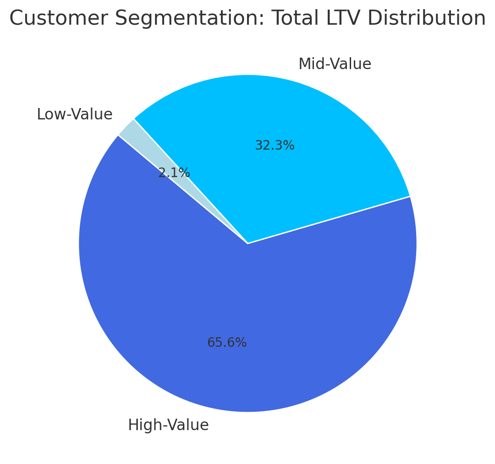

# 📊 Sales Analysis - SQL

## 📋 Overview
Analyzed customer behavior, retention, and lifetime value to help improve customer loyalty and increase revenue for the e-commerce business.

## ❓ Business Questions
- **Customer Segmentation:** Which customers bring in the most revenue?
- **Cohort Analysis:** How does revenue change across customer groups over time?
- **Retention Analysis:** Which customers stopped buying recently?

---

# 1. 🧮 Customer Segmentation Analysis

## 📌 Overview
**Goal:** Segment customers based on their **Total Lifetime Value (LTV)** to better understand revenue contribution by customer group.

- Customers grouped into:
  - **High-Value**
  - **Mid-Value**
  - **Low-Value**
- Key metric analyzed: **Total Revenue**

🖥️ **SQL Query:**   [1_customer_segmentation.sql](1_customer_segmentation.sql)

📊 **Visualization:** 

---

## 📊 Summary of Findings

| Segment       | % of Customers | % of Revenue | Revenue Contribution |
|---------------|----------------|--------------|-----------------------|
| **High-Value**| 25%            | 66%          | $135.4M               |
| **Mid-Value** | 50%            | 32%          | $66.6M                |
| **Low-Value** | 25%            | 2%           | $4.3M                 |

---

## 💡 Business Insights

### 🔹 High-Value Customers (66% Revenue | 12,372 Customers)
- Consider offering a **premium loyalty or membership program**.
- Retention is critical — these customers have a significant impact on overall revenue.

### 🔹 Mid-Value Customers (32% Revenue)
- Introduce **targeted promotions and upgrade incentives**.
- Opportunity to grow this group into high-value customers, increasing overall revenue.

### 🔹 Low-Value Customers (2% Revenue)
- Implement **re-engagement campaigns** and **discount-based offers**.
- Focus on increasing purchase frequency and customer value.

---

# 2. 📈 Cohort Analysis: Revenue Trends by Customer Group

This project focuses on **cohort-based revenue analysis** to uncover trends in **customer lifetime value (LTV)**, acquisition performance, and long-term revenue sustainability.

## 🧠 Objective
Evaluate how revenue evolves across customer cohorts and generate insights to drive retention, improve customer value, and support data-informed decision-making.

## 🔍 Analysis Approach

### 1. Define Customer Cohorts
- Customers are segmented based on their **acquisition year** (e.g., 2020, 2021, etc.)
- This allows us to track behavior and revenue contributions over time

### 2. Measure Cohort Revenue
- Monitor **monthly or quarterly revenue** by cohort
- Normalize by cohort size to calculate **Revenue per User (RPU)**

### 3. Identify Performance Trends
- Compare new vs older cohorts to assess customer retention
- Evaluate shifts in **LTV**, revenue consistency, and engagement

---

## 🧑‍💻 SQL Query
> Explore the logic behind the analysis:  
📄 [cohort_analysis](2_cohort_analysis.sql)

---

## 📊 Visualization

---

## 🔎 Key Insights
- 📉 **Revenue per customer is steadily declining**
  - Customers acquired in **2022–2024** show weaker performance than previous cohorts
- 📈 **Overall revenue is growing**, but mainly due to an increase in total users—not better customer value
- ⚠️ **2023 acquisition volume dropped**, potentially impacting future revenue growth

---

## 💡 Business Takeaways

- **Customer value is falling**—indicating a need to revisit retention strategies and product engagement
- The **2023 acquisition slump** may reflect issues with marketing, competition, or product-market fit
- With both **declining LTV** and fewer new customers, the business may face revenue stagnation if trends continue

---

# 3. Customer Retention

🖥️ **SQL Query:**   [3_retention_analysis](3_retention_analysis.sql)

## Analysis Summary:
- Found customers who are likely to stop buying.
- Studied when they last made a purchase.
- Noticed similar churn patterns across all customer groups.

### 📈 Visualization:

### 📊 Key Findings:
- Around **90% of customers churn within 2-3 years**, showing a consistent long-term trend.
- **Retention rates stay low (8-10%)** across all yearly cohorts, indicating a broader retention challenge.
- **Recent cohorts (2022-2023)** show similar patterns, suggesting future cohorts may behave the same without changes.

### 💡 Business Insights:
- **Focus on early engagement:** Boost customer loyalty in the first 1-2 years through onboarding incentives, rewards, and personalized offers.
- **Win-back high-value churned users:** Target these users with specific campaigns for better return on investment.
- **Predict and prevent churn:** Use early warning signals from customer behavior to proactively engage users at risk of leaving.

---

## ✅ Strategic Recommendations

- Keep high-value customers loyal with premium programs.
- Encourage mid-value customers to spend more with targeted offers.
- Re-engage low-value customers using discounts and campaigns.
- Focus on strong onboarding in the first 1–2 years.
- Run win-back campaigns for churned high-value users.
- Use data to spot and prevent churn early.
- Improve acquisition strategy to attract better long-term users.
- Boost overall customer value with better retention efforts.

---

## 🔧 Technical Details:
- **Database:** PostgreSQL
- **Analysis Tools:** PostgreSQL, DBeaver
- **Visualization:** ChatGPT